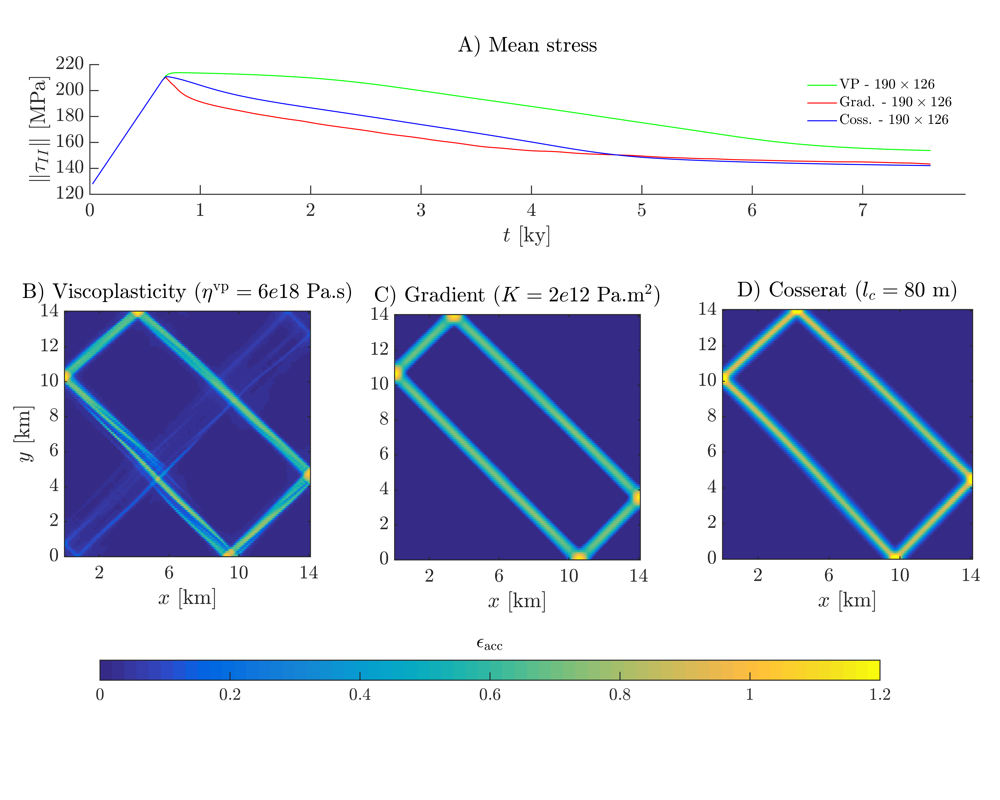

# Plasticity regularisation, G-Cubed (2023)

Scripts: [](https://zenodo.org/badge/latestdoi/630468209)       Data:[](https://doi.org/10.5281/zenodo.7692569)

This repository contains the scripts that were used for the preparation of the manuscript: [**A comparison of plasticity regularisation approaches for geodynamic modelling**](https://agupubs.onlinelibrary.wiley.com/doi/10.1029/2022GC010675) by T. Duretz, L. Räss, R. de Borst and T. Hageman published in *Geochemistry, Geophysics, Geosystems*.


### Installation

A specific Julia environment is provided (`Project.toml` file), in order to use it:
1. In Julia's REPL, switch to Pkg mode by typing `]`
2. activate the project by typing: `activate .`
3. dowload and compile dependencies by typing: `instantiate`

The scripts are build using [ParallelStencil](https://github.com/omlins/ParallelStencil.jl). To switch from CPU to GPU computing just modify `USE_GPU`:
```julia
USE_GPU  = true
```
If your machine contains several GPUs, then you are lucky. You can select the working GPU by setting the `GPU_ID`:
```julia
GPU_ID   = 0
```

### Scripts

The `scripts` folder contains julia scripts that can be used to reproduce the results of our study.
Three different model configurations are features:
1. Single shear band formation (`0_SingleShearBand` folder)
2. Shear band network arising from a random cohesion field (`1_RandomShearBands` folder)
3. Shear banding at the crustal scale (`2_CrustalScale` folder)

### Main parameters
These scripts were designed to study the effect of different regularisations that can be used to model frictional plastic shear banding. Each script contains a section `regularisation` that allows to easily switch between them. For example, this model will run with viscoplasticity and the Kelvin element viscosity is set to 2.5e20 Pa.s.
```julia
    # - regularisation
    η_vp      =  2.5e20      # Kelvin VP
    c_grad    =  0*1e13      # gradient
    coss      =  0.0         # cosserat switch
    G_coss    =  1e10        # cosserat
    l_coss    =  100.0       # cosserat
 ```
 The following modification would activate gradient plasticity with a gradient parameter of 1e13 Pa.m^2:
 ```julia
    # - regularisation
    η_vp      =  0*2.5e20    # Kelvin VP
    c_grad    =  1e13        # gradient
    coss      =  0.0         # cosserat switch
    G_coss    =  1e10        # cosserat
    l_coss    =  100.0       # cosserat
 ```
And this one would activate Cosserat plasticity with a characteristic length of 100 m:
 ```julia
    # - regularisation
    η_vp      =  0*2.5e20    # Kelvin VP
    c_grad    =  0*1e13      # gradient
    coss      =  1.0         # cosserat switch
    G_coss    =  1e10        # cosserat
    l_coss    =  100.0       # cosserat
 ```
One can also combine activate viscoplasticity together with gradient or Cosserat to benefit from both spatial and temporal regularisations.

<p align="center">
  
</p>
